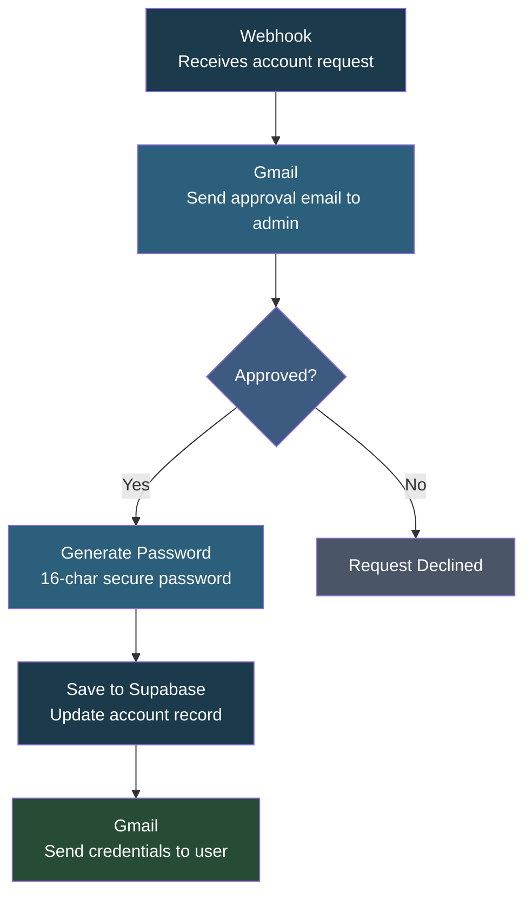

# Account Setup Request

## Overview

This automation handles **new account registration requests** with a built-in approval process. When someone requests an account, the system notifies an admin via email, waits for their approval or rejection, and if approved, automatically generates a secure password, saves it to the database, and sends the login credentials to the new user. No manual account creation needed.

## How It Works

```
Webhook -> Email Approval Request -> Check Approval -> Generate Password -> Save to Supabase -> Send Credentials
```

### Workflow Diagram



### Workflow Steps

1. **Webhook** - Receives a POST request containing the user's email, full name, and message.
2. **Send message and wait for response** - Sends an approval email to the admin with approve/decline buttons. Waits up to 48 hours for a response.
3. **Check Approval Status** - Evaluates whether the admin approved or declined the request.
4. **Generate Password** - Creates a cryptographically secure 16-character password with uppercase, lowercase, numbers, and symbols.
5. **Save to Supabase** - Updates the account_requests table with the generated password and approval timestamp.
6. **Send a message** - Emails the new user their login credentials (email + password), with the admin CC'd.

## Nodes

| Node | Type |
|------|------|
| Webhook | Webhook Trigger (POST) |
| Send message and wait for response | Gmail (send and wait) |
| Check Approval Status | Conditional (If) |
| Generate Password | JavaScript Code |
| Save to Supabase | Supabase (update) |
| Send a message | Gmail (send) |

## Integrations

- **Gmail** - Sends approval requests and credential emails
- **Supabase** - Stores account data and generated passwords

## Setup

1. Import `Account_setup_request.json` into your n8n instance.
2. Update credentials for Gmail and Supabase.
3. Update the admin email address in the approval node.
4. Activate the workflow and test with a sample webhook request.
